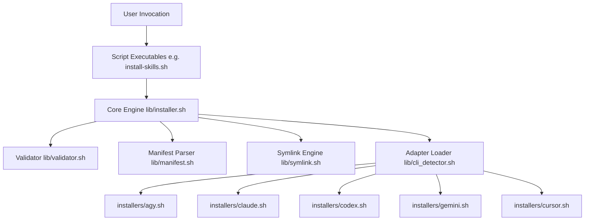

# AI Skills Manager

The single source of truth for managing and installing engineering standards, personas, and workflows as custom modular skills across multiple AI command line interfaces.

---

## Architecture

The AI Skills Manager uses an **Adapter Pattern** architecture to decouple the core framework routines (validation, dependency resolution, linking) from platform-specific custom prompt loading mechanisms.



### Key Modules:
- `lib/common.sh`: Centralizes arg parsing, version checks, and sets dry-run/verbose indicators.
- `lib/logger.sh`: Outputs status templates (`✓ Installed`, `✗ Error`) and displays execution times.
- `lib/filesystem.sh`: Protects filesystem checks and wraps commands for safe dry-runs.
- `lib/manifest.sh`: Interface to query `skill-manifest.yaml` properties via Python.
- `lib/validator.sh`: Scans markdown headers (Title, Summary, Purpose, Triggers, Workflow, Output, Examples, Dependencies) and flags broken links.
- `lib/symlink.sh`: Implements symlinking with copy fallback when symlinks fail.
- `lib/installer.sh`: Resolves dependency topological ordering and drives installation/removal sequence.

---

## Installation

1. Clone or copy the repository files to your environment (e.g. `/home/eisen/projects/ai-platform/ai-skills-manager`).
2. Make scripts executable:
   ```bash
   chmod +x *.sh installers/*.sh
   ```
3. Run the validator tool to check framework integrity:
   ```bash
   ./validate-skills.sh
   ```

---

## Supported CLIs

| CLI Platform | Supported | Skill Directory Location | Install Mode | Notes / Graceful Failures |
| :--- | :---: | :--- | :--- | :--- |
| **Antigravity CLI (AGY)** | **Yes** | `~/.gemini/config/skills` | Symlink | Installs skills as nested `skills/<skill_id>/SKILL.md` targets. |
| **Claude Code** | *No* | N/A | Unsupported | Informs user that settings belong in `~/.claude.json`. |
| **Codex CLI** | *No* | N/A | Unsupported | Informs user that Codex uses JS/TS plugin config structures. |
| **Gemini CLI** | *No* | N/A | Unsupported | Custom prompts should be passed inline or via environment options. |
| **Cursor CLI** | *No* | N/A | Unsupported | Prompts are managed via IDE settings ('Rules for AI'). |

---

## Examples

### Install skills to Antigravity CLI (AGY):
```bash
./install-skills.sh --agy
```

### Install skills with dry-run verification:
```bash
./install-skills.sh --agy --dry-run
```

### Update and synchronize skills:
```bash
./update-skills.sh --agy
```

### Run framework doctor health check:
```bash
./doctor.sh
```

### List skills grouped by category:
```bash
./list-skills.sh
```

---

## Manifest Schema

The single source of truth database is `skill-manifest.yaml`. Each skill entry defines:

```yaml
skills:
  - id: systematic-debugging
    name: "Systematic Debugging"
    version: 1.0.0
    category: core
    description: "Standardized Systematic Debugging module."
    author: "Zeraynce Engineering"
    directory: 01-core
    dependencies: []
    required_by:
      - create-ticket
      - fix-ticket
      - investigate-production-issue
    supported_clis:
      - agy
    install_mode: symlink
```

---

## Dependency System

When a workflow requires prerequisites (e.g. `create-ticket` depends on `systematic-debugging`), the installer uses topological sorting (Kahn's/DFS algorithm) to:
1. Load dependencies from `skill-manifest.yaml`.
2. Sequence installs so dependencies are linked first.
3. Detect circular dependencies and abort execution if cycles are found.

---

## Adding & Updating Skills

### Adding a new skill:
1. Add the markdown file under the matching category subdirectory inside `skillset/` (e.g. `skillset/01-core/new-skill.md`).
2. Add corresponding metadata fields to `skill-manifest.yaml`.
3. Run `./validate-skills.sh` to check formatting and links.
4. Execute `./update-skills.sh` to sync the new file with your target CLIs.

### Updating an existing skill:
1. Edit the markdown file inside the local `skillset/` subdirectory.
2. Increment the version tag in `skill-manifest.yaml`.
3. Run `./update-skills.sh` to push modifications to target directories.

---

## Troubleshooting

### Error: Missing Metadata Fields
**Cause**: The markdown file is missing required headings (such as `## Purpose` or `## Workflow`).
**Fix**: Edit the markdown file and ensure the required headings exist.

### Error: Broken Link Detected
**Cause**: A link using the `file://` scheme or a relative path points to a file that does not exist.
**Fix**: Verify the file path and update the reference in the markdown file.

### Error: Circular Dependency Detected
**Cause**: Skill A depends on Skill B, and Skill B depends on Skill A.
**Fix**: Redesign the skills manifest to eliminate recursive loops.

---

## FAQ

#### Can I install individual skills?
Yes, the framework allows individual CLI targeting via flags, but always sequences installs topologically to ensure all required dependencies are present.

#### Why does Claude Code/Codex/Gemini report "Unsupported"?
These platforms do not natively support modular, dynamic markdown custom prompt folders in their current CLI implementations. The framework detects these capabilities and gracefully fails instead of duplicating files or setting fake overrides.
